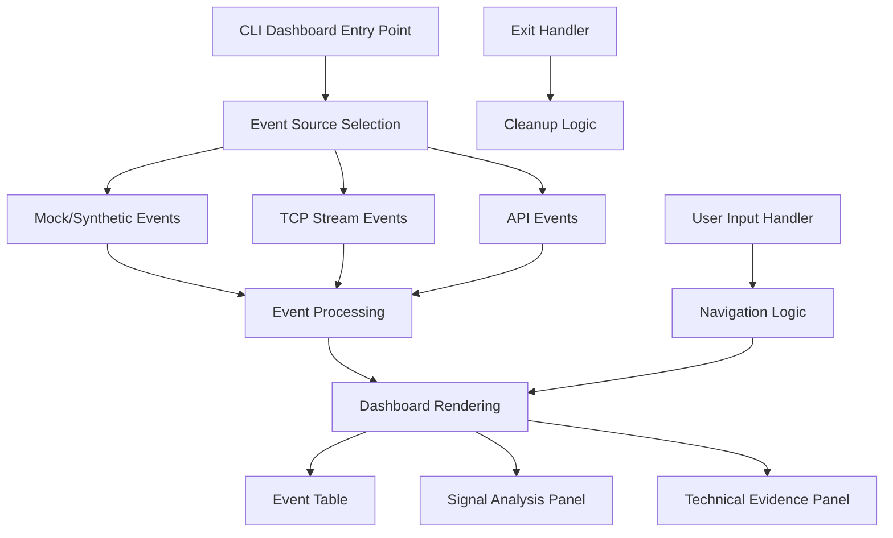

# Design Document

## Overview

This design addresses critical user experience issues in the CLI dashboard that are impacting demo quality and system usability. The automotive security monitoring system requires several targeted fixes to ensure smooth demonstrations and professional presentation quality. The design focuses on fixing display bugs, improving user interactions, and enhancing the overall demo experience without major architectural changes.

## Architecture

The improvements will be implemented within the existing CLI dashboard architecture, focusing on:

- **Event Generation Layer**: Fix synthetic signal generation and ScenarioType enum issues
- **Display Rendering Layer**: Eliminate data duplication and fix refresh bugs
- **User Interface Layer**: Improve threat counters and add professional exit experience
- **Startup Experience Layer**: Enhance ASCII art timing and system information display

### Current Architecture Context



## Components and Interfaces

### 1. Synthetic Signal Generation Fix

**Problem**: `ScenarioType.SIGNAL_CLONING_ATTACK` attribute error when using `--synthetic` flag.

**Root Cause Analysis**: The `generate_synthetic_signal_cloning_attack()` function exists in the detection adapter but `ScenarioType.SIGNAL_CLONING_ATTACK` is not defined in the enum.

**Solution Design**:
- Add missing `SIGNAL_CLONING_ATTACK` to `ScenarioType` enum in `utils/signal_constants.py`
- Update synthetic event generation to handle all attack types properly
- Ensure consistent mapping between attack types and scenario types

**Interface Changes**:
```python
# utils/signal_constants.py
class ScenarioType(Enum):
    NORMAL_OPERATION = "normal_operation"
    REPLAY_ATTACK = "replay_attack"
    JAMMING_ATTACK = "jamming_attack"
    BRUTE_FORCE_ATTACK = "brute_force_attack"
    SIGNAL_CLONING_ATTACK = "signal_cloning_attack"  # ADD THIS
```

### 2. Display Duplication Fix (Screen Size Issue)

**Problem**: Duplicate information appearing in Signal Analysis and Technical Evidence panels on larger screens, but works correctly on smaller screens.

**Root Cause Analysis**: This is a rendering/layout issue related to screen size handling, not a data structure problem. The Rich layout system may be wrapping or duplicating content when there's more available space on larger screens.

**Solution Design**:
- Fix Rich layout sizing and wrapping behavior for larger screens
- Ensure consistent panel sizing regardless of terminal dimensions
- Implement proper text wrapping and truncation for larger displays
- Test layout behavior across different screen sizes
- Preserve existing data structures (they work correctly)

**Interface Changes**:
```python
def render_evidence_panel(event, console_width=None):
    """Enhanced with screen-size aware rendering"""
    
def render_signal_metrics(event, max_width=None):
    """Enhanced with consistent sizing across screen sizes"""
    
def calculate_optimal_panel_dimensions(console_width, console_height):
    """Calculate consistent panel sizes for any screen size"""
```

### 3. Critical Alert Refresh Bug Fix

**Problem**: Dashboard constantly refreshes/flickers during CRITICAL threat events, making it unreadable.

**Root Cause Analysis**: The rendering logic likely has a performance issue or infinite update loop when processing CRITICAL events, possibly related to the threat level styling or update frequency.

**Solution Design**:
- Implement differential rendering to only update changed components
- Add refresh rate limiting for CRITICAL events
- Separate static content from dynamic content in rendering
- Implement proper state management to prevent unnecessary re-renders
- Add performance monitoring to identify refresh bottlenecks

**Interface Changes**:
```python
class DashboardState:
    """State management for stable rendering"""
    def __init__(self):
        self.last_render_hash = None
        self.critical_event_cooldown = 0
        self.refresh_limiter = RefreshLimiter()

def render_dashboard(events, selected_event, status_text, console, 
                    selected_event_idx=-1, status_only=False, 
                    show_help=False, current_page=0, 
                    force_refresh=False, state_manager=None):
    """Enhanced with refresh control"""
```

### 4. Threat Counter Accuracy Improvement

**Problem**: Threat counter not accurately counting all Suspicious, Malicious, and Critical threats.

**Root Cause Analysis**: The counter logic may be filtering events incorrectly or not properly categorizing threat levels.

**Solution Design**:
- Implement comprehensive threat counting logic
- Separate total event count from threat event count
- Add real-time counter updates with proper validation
- Ensure consistent threat level classification

**Interface Changes**:
```python
class ThreatCounter:
    """Accurate threat counting with validation"""
    def __init__(self):
        self.total_events = 0
        self.threat_events = 0
        self.threat_breakdown = {
            "Suspicious": 0,
            "Malicious": 0, 
            "Critical": 0
        }
    
    def update(self, event):
        """Update counters based on event threat level"""
        
    def get_summary(self):
        """Get formatted counter summary"""
```

### 5. Professional Exit Experience

**Problem**: Poor exit experience when pressing 'q' or Ctrl+C, leaving messy terminal state.

**Solution Design**:
- Implement Rich dialog system for exit confirmation
- Add options for saving session data (events, logs, reports)
- Ensure clean terminal restoration on exit
- Handle both graceful ('q') and interrupt (Ctrl+C) exits

**Interface Changes**:
```python
class ExitHandler:
    """Professional exit experience with save options"""
    
    async def handle_exit_request(self, events, logs):
        """Show exit dialog and handle user choice"""
        
    def show_exit_dialog(self):
        """Display Rich dialog with save options"""
        
    def save_session_data(self, events, logs, filepath):
        """Save session data to file"""
        
    def cleanup_terminal(self):
        """Restore clean terminal state"""
```

### 6. Enhanced Startup Experience

**Problem**: ASCII art logo only shows after program closes, no startup delay or information display.

**Solution Design**:
- Display ASCII art logo immediately on startup
- Show system information and selected options
- Add configurable delay before starting dashboard
- Smooth transition from startup screen to dashboard

**Interface Changes**:
```python
class StartupExperience:
    """Enhanced startup with logo and system info"""
    
    def display_startup_sequence(self, args):
        """Show logo, info, and transition to dashboard"""
        
    def show_ascii_logo(self):
        """Display professional ASCII art logo"""
        
    def show_system_info(self, args):
        """Display configuration and options"""
        
    def startup_delay(self, duration=3.0):
        """Configurable startup delay"""
```

## Data Models

### Enhanced Event Processing

```python
@dataclass
class ProcessedEvent:
    """Enhanced event with deduplication tracking"""
    raw_event: Dict[str, Any]
    processed_timestamp: float
    display_hash: str  # For deduplication
    threat_level: str
    is_critical: bool
    render_cache: Optional[Dict] = None

@dataclass 
class DashboardMetrics:
    """Dashboard performance and counter metrics"""
    total_events: int
    threat_events: int
    threat_breakdown: Dict[str, int]
    render_performance: Dict[str, float]
    last_update: float
```

### State Management

```python
@dataclass
class DashboardState:
    """Comprehensive dashboard state management"""
    events: List[ProcessedEvent]
    selected_event_idx: int
    current_page: int
    show_help: bool
    threat_counter: ThreatCounter
    last_render_hash: Optional[str]
    refresh_limiter: RefreshLimiter
    performance_metrics: DashboardMetrics
```

## Error Handling

### Synthetic Generation Error Handling

```python
def safe_synthetic_generation():
    """Robust synthetic event generation with fallbacks"""
    try:
        return generate_synthetic_event()
    except AttributeError as e:
        if "SIGNAL_CLONING_ATTACK" in str(e):
            # Fallback to available scenario types
            return generate_fallback_event()
        raise
    except Exception as e:
        logger.error(f"Synthetic generation failed: {e}")
        return generate_error_event()
```

### Rendering Error Handling

```python
def safe_render_dashboard():
    """Robust dashboard rendering with error recovery"""
    try:
        return render_dashboard_with_state_management()
    except Exception as e:
        logger.error(f"Render error: {e}")
        return render_minimal_dashboard()  # Fallback rendering
```

### Exit Error Handling

```python
def safe_exit_handler():
    """Robust exit handling with cleanup guarantee"""
    try:
        handle_professional_exit()
    except Exception as e:
        logger.error(f"Exit handler error: {e}")
    finally:
        ensure_terminal_cleanup()  # Always cleanup
```

## Testing Strategy

### Unit Tests

```python
def test_synthetic_generation_all_scenarios():
    """Test all scenario types generate without errors"""
    
def test_panel_rendering_across_screen_sizes():
    """Test panel rendering consistency on different screen sizes"""
    
def test_threat_counter_accuracy():
    """Test counter correctly counts all threat levels"""
    
def test_critical_event_rendering_stability():
    """Test dashboard remains stable during critical events"""
```

### Integration Tests

```python
def test_complete_startup_sequence():
    """Test full startup experience with logo and delay"""
    
def test_exit_dialog_functionality():
    """Test exit dialog and save functionality"""
    
def test_demo_mode_stability():
    """Test extended demo runs without issues"""
```

### Performance Tests

```python
def test_critical_event_refresh_performance():
    """Test rendering performance during critical events"""
    
def test_large_event_list_performance():
    """Test dashboard performance with many events"""
```

## Implementation Approach

### Phase 1: Critical Bug Fixes
1. Fix synthetic signal generation enum issue
2. Implement critical alert refresh bug fix
3. Fix display duplication on larger screens

### Phase 2: Counter and UX Improvements  
1. Implement accurate threat counter
2. Add professional exit experience
3. Enhance startup sequence

### Phase 3: Polish and Testing
1. Comprehensive testing of all improvements
2. Performance optimization
3. Documentation updates

## Performance Considerations

### Rendering Optimization
- Implement differential rendering for large event lists
- Add caching for expensive panel computations
- Limit refresh rates during high-activity periods

### Memory Management
- Implement event list size limits to prevent memory growth
- Add cleanup for cached rendering data
- Monitor memory usage during extended demos

### Responsiveness
- Ensure UI remains responsive during critical events
- Implement non-blocking rendering where possible
- Add performance monitoring and alerting

This design provides a comprehensive solution to all identified demo issues while maintaining the existing architecture and ensuring professional presentation quality.