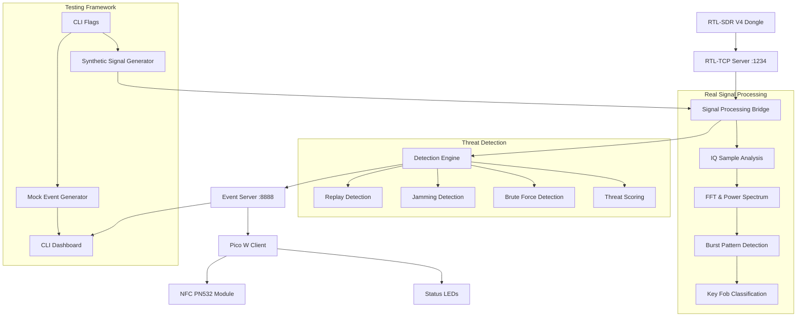
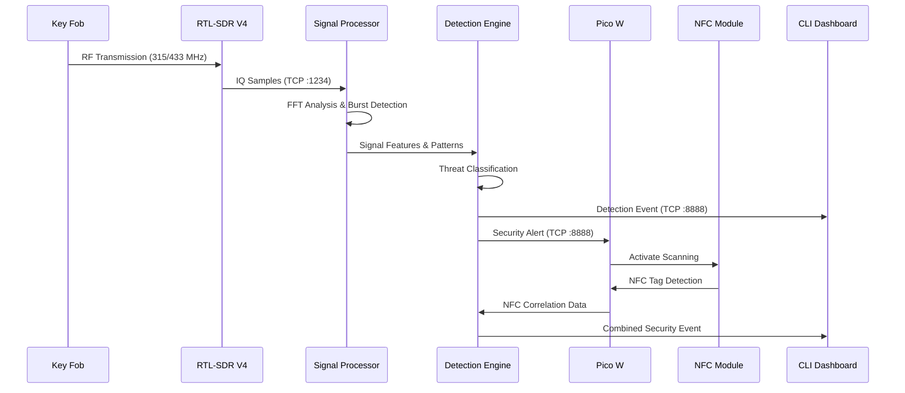

# RTL-SDR to NFC Integration Design

## Overview

This design implements a complete automotive security monitoring system that processes real RTL-SDR signals from key fobs and other automotive devices, applies sophisticated threat detection algorithms, and correlates with NFC detection on the Raspberry Pi Pico W. The system is designed to demonstrate actual signal processing capabilities for the capstone presentation.

## Architecture

### System Components



### CLI Dashboard Flags

```
python cli_dashboard.py [options]

Options:
  --mock                  Enable mock mode to simulate detection events
  --synthetic             Enable synthetic signal generation (requires --mock)
  --source {api,tcp}      Event source: api or tcp
  --api-url URL           API URL for event source
  --tcp-host HOST         TCP event stream host
  --tcp-port PORT         TCP event stream port
  --detailed              Enable detailed signal analysis
  --nfc                   Enable NFC correlation detection
  --event INDEX           Select a specific event to view
```

### Data Flow Architecture



## Components and Interfaces

### Enhanced Signal Processing Bridge

The `SignalProcessingBridge` class will be enhanced to provide real-time analysis of automotive RF signals:

```python
class EnhancedSignalProcessingBridge:
    def __init__(self, rtl_server_manager):
        self.rtl_server = rtl_server_manager
        self.signal_analyzer = AutomotiveSignalAnalyzer()
        self.detection_engine = ThreatDetectionEngine()
        self.signal_history = SignalHistoryBuffer(max_size=1000)
        
    async def process_samples(self, raw_data, sample_count):
        # Convert raw IQ to complex samples
        complex_samples = self.convert_iq_samples(raw_data)
        
        # Extract signal features
        signal_features = self.signal_analyzer.extract_features(complex_samples)
        
        # Detect automotive signals
        automotive_signals = self.signal_analyzer.detect_automotive_patterns(signal_features)
        
        # Apply threat detection
        threat_events = []
        for signal in automotive_signals:
            threat_event = self.detection_engine.analyze_threat(signal, self.signal_history)
            if threat_event:
                threat_events.append(threat_event)
                
        # Update signal history
        self.signal_history.add_signals(automotive_signals)
        
        return threat_events
```

### Automotive Signal Analyzer

New component for analyzing real key fob and automotive RF patterns:

```python
class AutomotiveSignalAnalyzer:
    def __init__(self):
        self.key_fob_patterns = self.load_key_fob_signatures()
        self.frequency_bands = {
            'north_america': 315e6,
            'europe': 433.92e6,
            'japan': 315e6
        }
        
    def extract_features(self, complex_samples):
        """Extract key features from IQ samples"""
        return {
            'power_spectrum': self.compute_power_spectrum(complex_samples),
            'burst_timing': self.detect_burst_timing(complex_samples),
            'modulation_type': self.classify_modulation(complex_samples),
            'frequency_deviation': self.measure_frequency_deviation(complex_samples),
            'signal_bandwidth': self.measure_bandwidth(complex_samples)
        }
        
    def detect_automotive_patterns(self, signal_features):
        """Detect patterns specific to automotive devices"""
        detected_signals = []
        
        # Key fob detection
        if self.is_key_fob_pattern(signal_features):
            detected_signals.append({
                'type': 'key_fob',
                'confidence': self.calculate_key_fob_confidence(signal_features),
                'features': signal_features,
                'timestamp': time.time()
            })
            
        # TPMS detection
        if self.is_tpms_pattern(signal_features):
            detected_signals.append({
                'type': 'tpms',
                'confidence': self.calculate_tpms_confidence(signal_features),
                'features': signal_features,
                'timestamp': time.time()
            })
            
        return detected_signals
        
    def is_key_fob_pattern(self, features):
        """Identify key fob specific characteristics"""
        # Check for FSK modulation
        if features['modulation_type'] != 'FSK':
            return False
            
        # Check burst timing (typical key fob: 3-5 bursts, 10-20ms apart)
        burst_timing = features['burst_timing']
        if not (3 <= len(burst_timing) <= 5):
            return False
            
        # Check inter-burst intervals
        intervals = np.diff(burst_timing)
        if not all(10e-3 <= interval <= 20e-3 for interval in intervals):
            return False
            
        # Check frequency deviation (typical: ±20-50 kHz)
        freq_dev = features['frequency_deviation']
        if not (20e3 <= freq_dev <= 50e3):
            return False
            
        return True
```

### Threat Detection Engine

Enhanced threat detection with real signal analysis:

```python
class ThreatDetectionEngine:
    def __init__(self):
        self.replay_detector = ReplayAttackDetector()
        self.jamming_detector = JammingDetector()
        self.brute_force_detector = BruteForceDetector()
        
    def analyze_threat(self, signal, signal_history):
        """Analyze signal for security threats"""
        threat_indicators = []
        
        # Replay attack detection
        replay_result = self.replay_detector.check_replay(signal, signal_history)
        if replay_result['is_replay']:
            threat_indicators.append({
                'type': 'replay_attack',
                'confidence': replay_result['confidence'],
                'evidence': replay_result['evidence']
            })
            
        # Jamming detection
        jamming_result = self.jamming_detector.check_jamming(signal, signal_history)
        if jamming_result['is_jamming']:
            threat_indicators.append({
                'type': 'jamming_attack',
                'confidence': jamming_result['confidence'],
                'evidence': jamming_result['evidence']
            })
            
        # Brute force detection
        brute_force_result = self.brute_force_detector.check_brute_force(signal, signal_history)
        if brute_force_result['is_brute_force']:
            threat_indicators.append({
                'type': 'brute_force_attack',
                'confidence': brute_force_result['confidence'],
                'evidence': brute_force_result['evidence']
            })
            
        # Generate threat event if any indicators found
        if threat_indicators:
            return self.generate_threat_event(signal, threat_indicators)
            
        # Generate benign event for legitimate signals
        return self.generate_benign_event(signal)
        
class ReplayAttackDetector:
    def __init__(self):
        self.similarity_threshold = 0.95
        self.time_window = 300  # 5 minutes
        
    def check_replay(self, signal, signal_history):
        """Detect replay attacks by comparing with recent signals"""
        recent_signals = signal_history.get_recent_signals(self.time_window)
        
        for historical_signal in recent_signals:
            similarity = self.calculate_signal_similarity(signal, historical_signal)
            
            if similarity > self.similarity_threshold:
                # Check timing characteristics
                time_diff = signal['timestamp'] - historical_signal['timestamp']
                
                # Replay attacks typically have identical signals with different timing
                if self.has_replay_timing_characteristics(signal, historical_signal):
                    return {
                        'is_replay': True,
                        'confidence': similarity,
                        'evidence': {
                            'original_timestamp': historical_signal['timestamp'],
                            'replay_timestamp': signal['timestamp'],
                            'signal_similarity': similarity,
                            'timing_anomaly': self.analyze_timing_anomaly(signal, historical_signal)
                        }
                    }
                    
        return {'is_replay': False}
        
    def calculate_signal_similarity(self, signal1, signal2):
        """Calculate similarity between two signals"""
        # Compare power spectrum
        spectrum_similarity = self.compare_power_spectra(
            signal1['features']['power_spectrum'],
            signal2['features']['power_spectrum']
        )
        
        # Compare burst timing
        timing_similarity = self.compare_burst_timing(
            signal1['features']['burst_timing'],
            signal2['features']['burst_timing']
        )
        
        # Weighted average
        return 0.7 * spectrum_similarity + 0.3 * timing_similarity
```

### Enhanced Pico W Integration

The Pico W client will be enhanced to correlate NFC detection with RF threats:

```python
class EnhancedAutomotiveSecurityPico:
    def __init__(self):
        super().__init__()
        self.nfc_correlation_mode = False
        self.active_rf_threat = None
        self.correlation_timeout = 30  # seconds
        
    async def process_signal_detection(self, detection_data):
        """Enhanced processing with NFC correlation"""
        detections = detection_data.get('detections', [])
        
        for detection in detections:
            threat_level = detection.get('threat_level', 0)
            
            # Activate NFC correlation for high-threat events
            if isinstance(threat_level, (float, int)) and threat_level > 0.7:
                await self.activate_nfc_correlation(detection)
                
            # Process as before
            await self.generate_security_alert(detection, detection_data)
            
    async def activate_nfc_correlation(self, rf_threat):
        """Activate NFC scanning when RF threat detected"""
        print(f"[NFC CORRELATION] Activating NFC scanning for {rf_threat['event_type']}")
        
        self.nfc_correlation_mode = True
        self.active_rf_threat = rf_threat
        self.led_nfc.on()  # Indicate active NFC scanning
        
        # Set timeout to deactivate correlation mode
        asyncio.create_task(self.nfc_correlation_timeout())
        
    async def nfc_correlation_timeout(self):
        """Timeout NFC correlation mode"""
        await asyncio.sleep(self.correlation_timeout)
        
        if self.nfc_correlation_mode:
            print("[NFC CORRELATION] Timeout - deactivating NFC correlation")
            self.nfc_correlation_mode = False
            self.active_rf_threat = None
            self.led_nfc.off()
            
    async def handle_nfc_detection(self, uid):
        """Enhanced NFC handling with RF correlation"""
        uid_hex = [hex(b) for b in uid]
        uid_str = ':'.join(uid_hex)
        
        nfc_data = {
            'type': 'nfc_detection',
            'timestamp': time.time(),
            'uid': uid_hex,
            'uid_length': len(uid),
            'detection_context': 'automotive_monitoring'
        }
        
        # Check for RF threat correlation
        if self.nfc_correlation_mode and self.active_rf_threat:
            print(f"[CORRELATION] NFC detection during RF threat: {self.active_rf_threat['event_type']}")
            
            # Generate correlated security event
            correlated_event = {
                'type': 'correlated_security_event',
                'timestamp': time.time(),
                'rf_threat': self.active_rf_threat,
                'nfc_detection': nfc_data,
                'correlation_type': 'rf_nfc_proximity',
                'threat_escalation': 'high_confidence_attack'
            }
            
            await self.send_to_server(correlated_event)
            
            # Visual indication of correlation
            for _ in range(5):
                self.led_alert.on()
                self.led_nfc.on()
                await asyncio.sleep(0.1)
                self.led_alert.off()
                self.led_nfc.off()
                await asyncio.sleep(0.1)
                
            # Deactivate correlation mode
            self.nfc_correlation_mode = False
            self.active_rf_threat = None
        else:
            print(f"NFC detected: UID = {uid_str}")
            
        await self.send_to_server(nfc_data)
```

## Data Models

### Signal Feature Model

```python
@dataclass
class SignalFeatures:
    timestamp: float
    frequency: float
    power_spectrum: np.ndarray
    burst_timing: List[float]
    modulation_type: str
    frequency_deviation: float
    signal_bandwidth: float
    snr: float
    rssi: float
    
    def to_dict(self):
        return {
            'timestamp': self.timestamp,
            'frequency': self.frequency,
            'power_spectrum': self.power_spectrum.tolist(),
            'burst_timing': self.burst_timing,
            'modulation_type': self.modulation_type,
            'frequency_deviation': self.frequency_deviation,
            'signal_bandwidth': self.signal_bandwidth,
            'snr': self.snr,
            'rssi': self.rssi
        }
```

### Threat Event Model

```python
@dataclass
class ThreatEvent:
    event_id: str
    timestamp: float
    event_type: str  # 'key_fob_transmission', 'replay_attack', 'jamming_attack', etc.
    threat_level: float  # 0.0 to 1.0
    confidence: float
    signal_features: SignalFeatures
    evidence: Dict[str, Any]
    recommended_action: str
    
    def to_dict(self):
        return {
            'event_id': self.event_id,
            'timestamp': self.timestamp,
            'event_type': self.event_type,
            'threat_level': self.threat_level,
            'confidence': self.confidence,
            'signal_features': self.signal_features.to_dict(),
            'evidence': self.evidence,
            'recommended_action': self.recommended_action
        }
```

## Error Handling

### Hardware Failure Recovery

```python
class HardwareFailureHandler:
    def __init__(self):
        self.rtl_sdr_available = False
        self.pico_w_connected = False
        self.fallback_mode = False
        
    async def handle_rtl_sdr_failure(self):
        """Handle RTL-SDR disconnection or failure"""
        print("[ERROR] RTL-SDR failure detected - attempting recovery")
        
        # Attempt reconnection
        for attempt in range(3):
            if await self.test_rtl_sdr_connection():
                print(f"[RECOVERY] RTL-SDR reconnected on attempt {attempt + 1}")
                self.rtl_sdr_available = True
                return True
            await asyncio.sleep(2 ** attempt)
            
        # Fall back to mock mode for demonstration
        print("[FALLBACK] Switching to mock mode for demonstration")
        self.fallback_mode = True
        return False
        
    async def handle_pico_w_failure(self):
        """Handle Pico W disconnection"""
        print("[ERROR] Pico W disconnection detected")
        
        # Continue RF processing without NFC correlation
        print("[DEGRADED] Continuing RF processing without NFC correlation")
        return True
```

## Testing Strategy

### Signal Processing Tests

```python
class TestSignalProcessing:
    def test_key_fob_detection(self):
        """Test detection of real key fob signals"""
        # Load recorded key fob IQ samples
        key_fob_samples = self.load_test_samples('key_fob_unlock.iq')
        
        # Process samples
        analyzer = AutomotiveSignalAnalyzer()
        features = analyzer.extract_features(key_fob_samples)
        signals = analyzer.detect_automotive_patterns(features)
        
        # Verify detection
        assert len(signals) == 1
        assert signals[0]['type'] == 'key_fob'
        assert signals[0]['confidence'] > 0.8
        
    def test_replay_attack_detection(self):
        """Test detection of replay attacks"""
        # Load original and replayed signals
        original_signal = self.load_test_samples('original_key_fob.iq')
        replayed_signal = self.load_test_samples('replayed_key_fob.iq')
        
        # Process both signals
        detector = ReplayAttackDetector()
        signal_history = SignalHistoryBuffer()
        
        # Add original to history
        signal_history.add_signal(original_signal)
        
        # Test replay detection
        result = detector.check_replay(replayed_signal, signal_history)
        
        assert result['is_replay'] == True
        assert result['confidence'] > 0.9
```

### Integration Tests

```python
class TestSystemIntegration:
    async def test_end_to_end_detection(self):
        """Test complete system from RTL-SDR to CLI display"""
        # Start system components
        rtl_server = RTLTCPServerManager()
        signal_bridge = EnhancedSignalProcessingBridge(rtl_server)
        
        # Inject test signal
        test_signal = self.generate_key_fob_signal()
        
        # Process signal
        events = await signal_bridge.process_samples(test_signal, 1)
        
        # Verify event generation
        assert len(events) > 0
        assert events[0]['event_type'] in ['key_fob_transmission', 'replay_attack']
        
    async def test_nfc_correlation(self):
        """Test NFC correlation with RF threats"""
        pico = EnhancedAutomotiveSecurityPico()
        
        # Simulate high-threat RF detection
        rf_threat = {'event_type': 'replay_attack', 'threat_level': 0.9}
        await pico.activate_nfc_correlation(rf_threat)
        
        # Simulate NFC detection
        test_uid = [0x04, 0x12, 0x34, 0x56]
        await pico.handle_nfc_detection(test_uid)
        
        # Verify correlation event generated
        assert pico.nfc_correlation_mode == False  # Should deactivate after correlation
```

This design provides a comprehensive system for processing real RTL-SDR signals, detecting automotive threats, and correlating with NFC detection to demonstrate actual security monitoring capabilities for your capstone presentation.