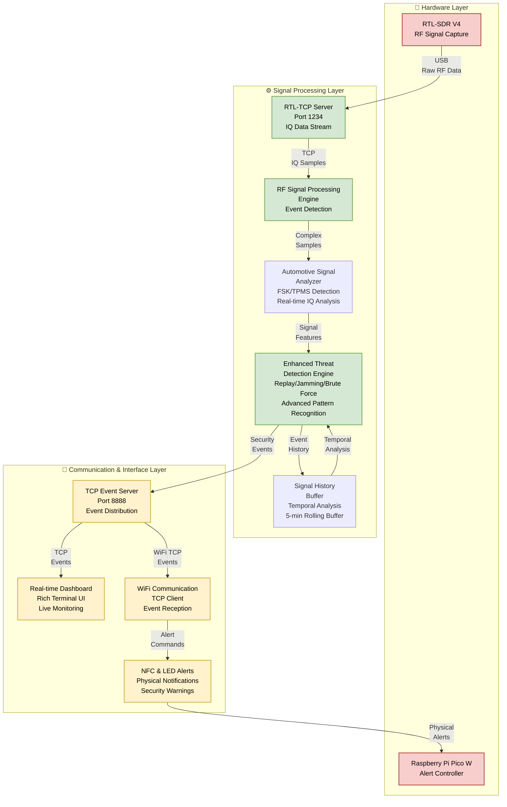
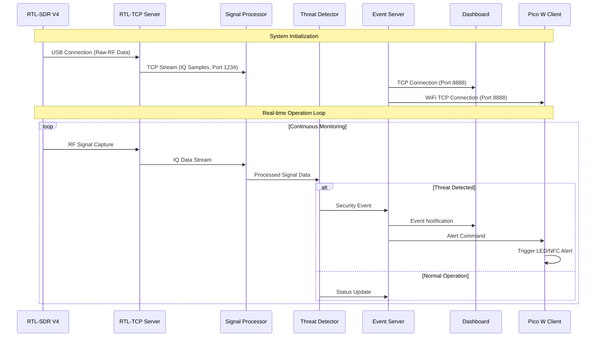
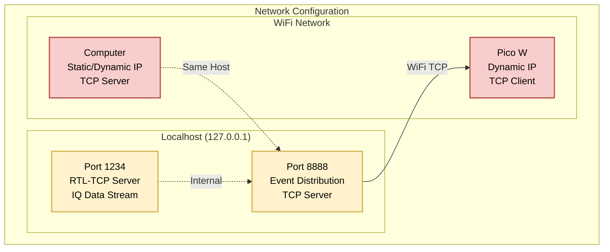
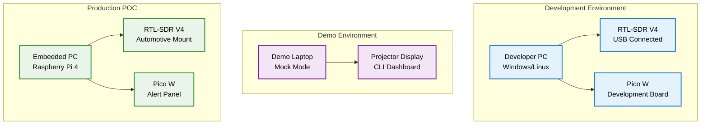

# Automotive Security POC - System Architecture

## High-Level Architecture Overview

## Detailed Component Architecture

```mermaid
graph LR
    %% RF Capture & Processing Chain
    subgraph RF_CHAIN ["RF Signal Processing Chain"]
        direction TB
        A[RTL-SDR V4 Dongle] --> B[RTL-TCP Server<br/>Port 1234]
        B --> C[Signal Bridge<br/>IQ Processing]
        C --> C1[Automotive Signal<br/>Analyzer<br/>FSK/TPMS Detection]
        C1 --> D[Enhanced Event<br/>Detection<br/>Pattern Recognition]
        D --> D1[Signal History<br/>Buffer<br/>Temporal Analysis]
        D1 --> E[Threat Detection<br/>Engine<br/>Replay/Jamming/Brute Force]
    end
    
    %% Event Distribution
    subgraph EVENT_DIST ["Event Distribution System"]
        direction TB
        F[TCP Event Server<br/>Port 8888]
        G[Event Queue<br/>Management]
        H[Client Connection<br/>Handler]
        
        F --> G
        G --> H
    end
    
    %% Client Systems
    subgraph CLIENTS ["Client Systems"]
        direction TB
        I[CLI Dashboard<br/>Rich Terminal UI]
        J[Pico W TCP Client<br/>WiFi Connection]
        K[Alert System<br/>LEDs & NFC]
        
        J --> K
    end
    
    %% Connections
    E --> F
    H --> I
    H --> J
    
    %% Styling
    classDef rfChain fill:#e1f5fe,stroke:#0277bd,stroke-width:2px,color:#000
    classDef eventDist fill:#f3e5f5,stroke:#7b1fa2,stroke-width:2px,color:#000
    classDef clients fill:#e8f5e8,stroke:#388e3c,stroke-width:2px,color:#000
    
    class A,B,C,D,E rfChain
    class F,G,H eventDist
    class I,J,K clients
```

## Data Flow & Protocol Stack

## Network & Port Configuration

## Technology Stack Overview

| Layer | Component | Technology | Purpose |
|-------|-----------|------------|---------|
| **Hardware** | RTL-SDR V4 | USB RF Dongle | RF signal capture and digitization |
| **Hardware** | Raspberry Pi Pico W | MicroPython | WiFi-enabled alert controller |
| **Processing** | RTL-TCP Server | C/C++ Binary | Raw IQ data streaming |
| **Processing** | Signal Bridge | Python + NumPy | Signal processing and analysis |
| **Processing** | Automotive Analyzer | Python + SciPy | Advanced automotive signal analysis with FSK/TPMS detection |
| **Processing** | Signal History Buffer | Python + Threading | Thread-safe temporal analysis and replay detection (5-min buffer) |
| **Processing** | Threat Detection Engine | Python + Pydantic | Enhanced security event classification with confidence scoring |
| **Communication** | Event Server | Python + asyncio | TCP event distribution |
| **Interface** | CLI Dashboard | Python + Rich | Real-time monitoring interface |
| **Alerts** | NFC/LED System | MicroPython | Physical security notifications |

## Key Features

### 🔒 Security Monitoring
- Real-time RF signal analysis
- Automotive protocol detection
- Threat level classification
- Event logging and reporting

### 🚀 Performance
- Low-latency event processing
- Concurrent client support
- Efficient TCP streaming
- Hardware-accelerated alerts

### 🛠️ Development Features
- Mock mode for testing
- Modular architecture
- Comprehensive logging
- Hardware abstraction layer

### 📊 Monitoring & Visualization
- Rich terminal dashboard
- Real-time event display
- Threat level indicators
- Historical event logging

## Deployment Architecture

